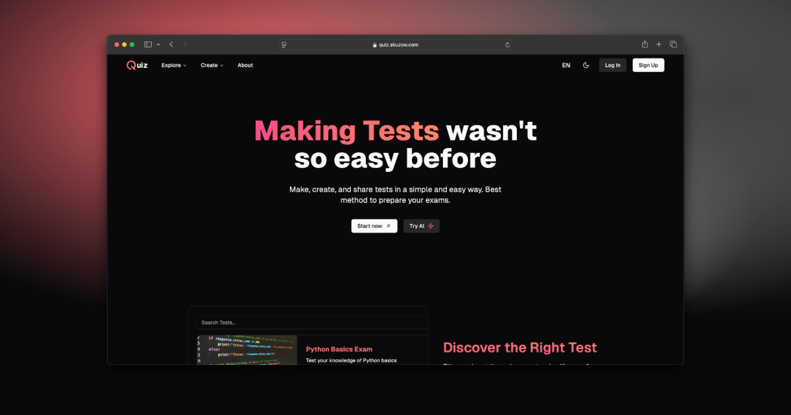

<div align="center">
  <a href="https://quiz.skuzow.com">
    
  </a>
</div>

<p/>

<div align="center">
    <a href="https://quiz.skuzow.com" target="_blank">
        Website
    </a>
    <span>&nbsp;·&nbsp;</span>
    <a href="https://github.com/skuzow/quiz?tab=readme-ov-file#-stack">
        Stack
    </a>
    <span>&nbsp;·&nbsp;</span>
    <a href="https://github.com/skuzow/quiz?tab=readme-ov-file#-contribute">
        Contribute
    </a>
</div>

<br/>

<div align="center">

[](https://nuxt.com)
[](https://vuejs.org)
[](https://vitest.dev)
[](https://www.typescriptlang.org)
[](https://tailwindcss.com)

</div>

<div align="center">

[](https://github.com/skuzow/quiz/blob/main/LICENSE)
[](https://github.com/skuzow/quiz/issues)
[](https://github.com/skuzow/quiz/pulls)
[](https://github.com/skuzow/quiz/forks)
[](https://github.com/skuzow/quiz/stargazers)

</div>

## 📦 Stack

- [**Nuxt**](https://nuxt.com) - The Progressive Web Framework.
- [**Vue**](https://vuejs.org) - The Progressive JavaScript Framework.
- [**Vitest**](https://vitest.dev) - Next Generation Testing Framework.
- [**Typescript**](https://www.typescriptlang.org) - JavaScript with syntax for types.
- [**Tailwind CSS**](https://tailwindcss.com) - A utility-first CSS framework for rapidly building custom designs.
- [**better-auth**](https://www.better-auth.com) - The most comprehensive authentication framework for TypeScript.
- [**shadcn-vue**](https://www.shadcn-vue.com) - Beautifully designed components for Vue.
- [**Lucide Icons**](https://lucide.dev) - Beautiful & consistent icons.
- [**ESLint**](https://eslint.org) - A tool for checking and enforcing code quality.
- [**Prettier**](https://prettier.io) + [prettier-plugin-tailwindcss](https://github.com/tailwindlabs/prettier-plugin-tailwindcss) - An opinionated code formatter.

## 🚀 Contribute

1. [Fork](https://github.com/skuzow/quiz/fork) the repository.

2. Install dependencies:

```bash
# Install pnpm globally if you don't have it:
npm install -g pnpm

# and install dependencies:
pnpm install
```

3. Fill out `.env` file with your own values. Use [`.env.example`](https://github.com/skuzow/quiz/blob/main/.env.example) as a reference.

4. Run prisma generate:

```bash
pnpm prisma:generate
```

5. Run the development server:

```bash
pnpm dev
```

Open up [http://localhost:3000](http://localhost:3000) and make your changes ⚡️.

## 💫 Contributors

[](https://github.com/skuzow/quiz/graphs/contributors)
